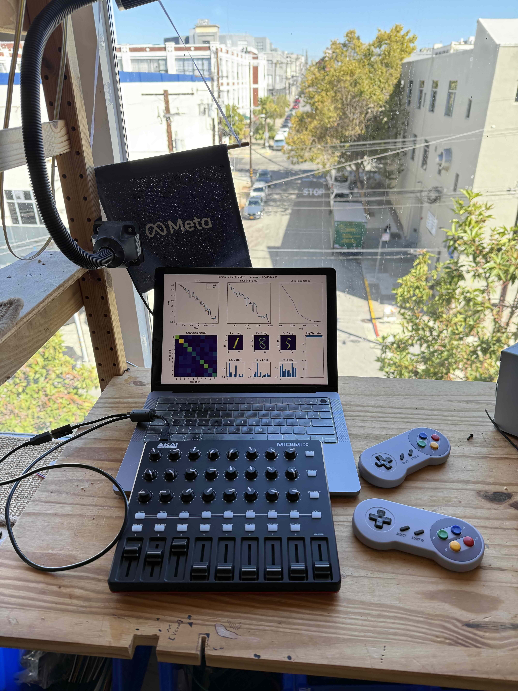

# HUman DEScent (UNDER CONSTRUCTION)

Human Descent opens the door for you to explore neural network optimization in high-dimensional weight space using the MNIST dataset. Manipulate everyday controllers (keyboard, xbox, DJ MIDI), each corresponding to a random direction in high dimensional weight space, to gain intuitive insights into the dynamics and complexities of neural network training.

[Demo video 2D/3D](https://youtu.be/VtF9dwoNQ_0)

### Older demo
[Demo video](https://youtu.be/mqAmaBP3-Q4)

## Installation

```
git clone https://github.com/misko/human_descent.git # clone the repo
python3 -m venv hudes_env # create a virual enviornment
source hudes_env/bin/activate 
cd human_descent
pip install . # install human descent and its dependencies in the virtual env
bash run.sh # download mnist, run the server, and then run the client!
```

## Details 

The aim of this repository is to build an interactive tool to allow humans to directly
optimize high dimension problems such as neural network training.

A can use any of the ineractive inputs ([Xtouch mini midi mixer](https://www.amazon.com/gp/product/B013JLZCLS), [Xbox like controllers](https://www.amazon.com/gp/product/B091Y7HHS1), keyboard, etc..) to control a random n-dimensional subspace of parameter space at a time. 

Iteratively selecting between new training batches and different random subspaces this allows you to optimize a very high dimensional weight space.

For example its possible to train a 26,000 parameter MNIST model using a 6 dimensional keyboard input in about 10 minutes.



